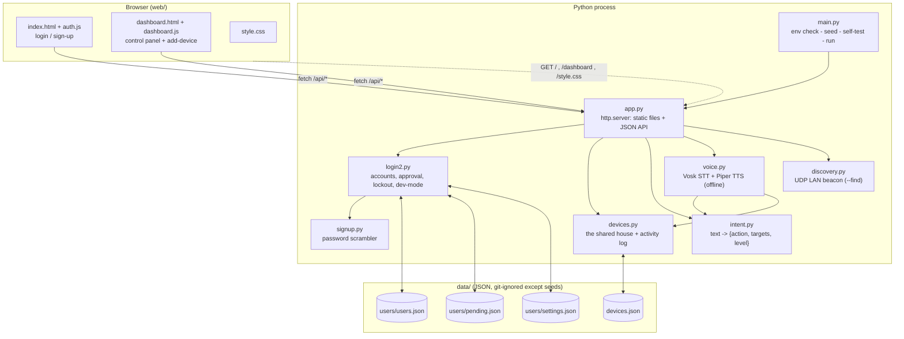
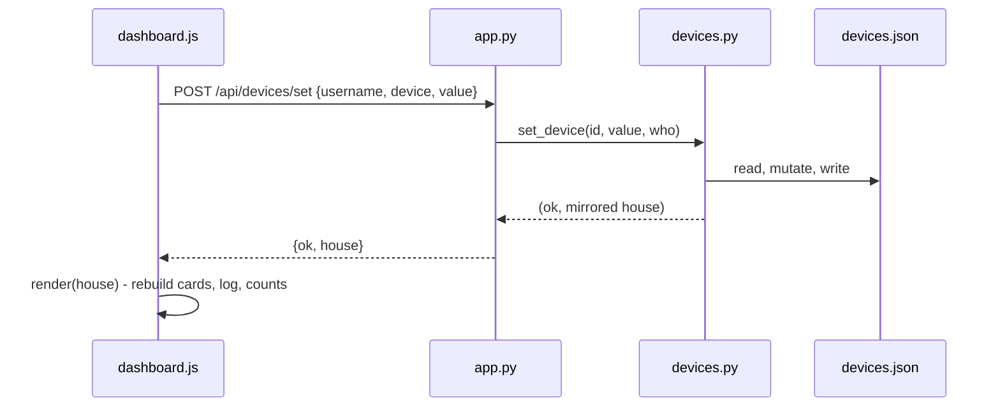
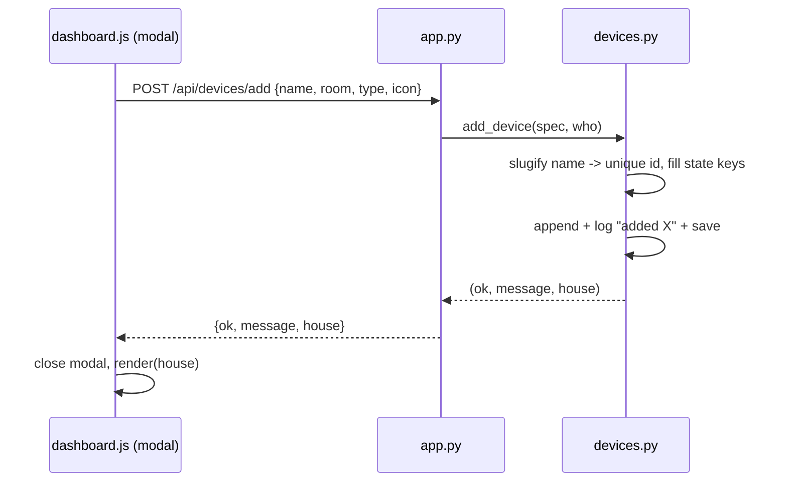
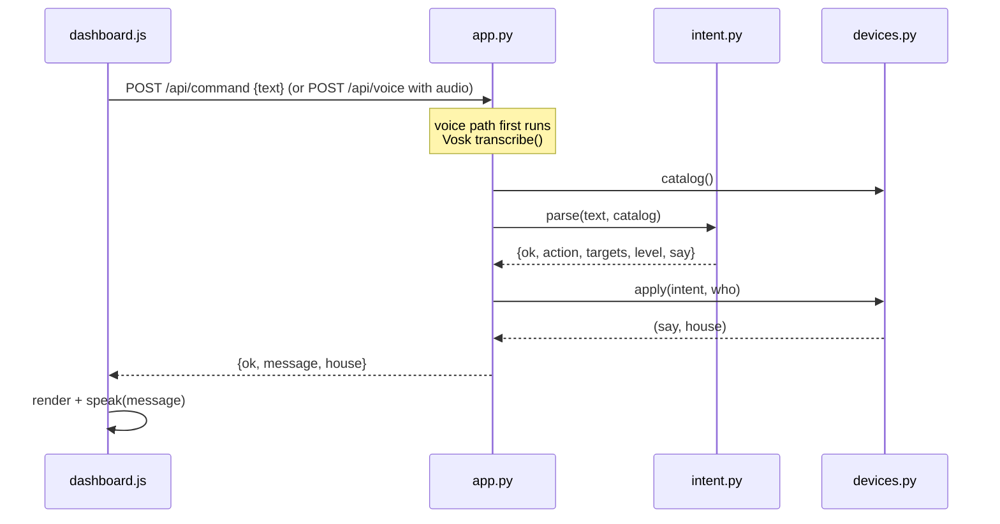

# Sync-Ghar — System Architecture

A small smart-home demo: sign up, get approved by an admin, then control
your devices — lights, fans, locks, dimmers — by **clicking**, by **typing**,
or **by voice**. No database, no web framework: Python's standard library
plus plain JSON files, and two optional offline speech models (Vosk + Piper).

---

## 1. The big picture



Everything runs in **one process on one machine**. The server binds every
network interface, so any phone or laptop on the same Wi-Fi can open it at
`http://<host-ip>:8000`. There is no per-request session token — the browser
keeps the logged-in user in `localStorage` and sends the username with each
write.

---

## 2. Components

| File | Responsibility | Key functions |
|------|----------------|---------------|
| `main.py` | One command to run it all. Checks the environment, seeds a starter admin if the user DB is empty, self-tests every module in a sandboxed copy of `data/`, then starts the server. | `check_environment`, `ensure_database`, `self_test`, `sandboxed_data` |
| `app.py` | The web server: a single `BaseHTTPRequestHandler`. `do_GET` serves `web/` and read-only endpoints; `do_POST` is the write API; `_handle_voice` takes raw audio. `ThreadingHTTPServer`, optional self-signed HTTPS for mic access on other devices. | `do_GET`, `do_POST`, `_handle_voice`, `serve` |
| `login2.py` | Accounts. `request_account` writes to `pending.json` (or straight to `users.json` in dev mode); `approve` moves a record across; `login` verifies, and after a wrong password imposes a **cooldown** (`cooldown_until` on the record, doubling 5s → 10s → 20s …, env `SMARTHOME_LOGIN_COOLDOWN`) before locking after 5 misses. Every approved user is also an admin. Dev-mode flag lives in `settings.json`. | `request_account`, `approve`, `login`, `seconds_until_retry`, `is_admin` |
| `signup.py` | The password scrambler. SHA-256 iterated a random *rounds* number of times (acts as a per-user salt) plus a hashed Fibonacci number as a second fingerprint. The real password is never stored. | `password_funct`, `password_matches` |
| `devices.py` | **The shared house.** A list of device dicts + a rolling 12-entry activity log, all in `devices.json`. Handles add / remove / set / bulk / intent-apply. Mirrors the three built-in devices onto legacy flat keys for older callers. | `get_state`, `set_device`, `all_devices`, `add_device`, `remove_device`, `apply`, `catalog` |
| `intent.py` | Pure text → instruction. No side effects. Knows the three starter devices always, and any runtime-added devices via an optional `catalog` argument. Understands on/off, lock/unlock, "everything", and dimmer levels ("set the lamp to 40"). | `parse` |
| `voice.py` | Offline speech. `transcribe` (Vosk, with a vocabulary-locked pass built from `intent.py` for accuracy), `answer` (runs text through `intent` → `devices`, else a chatbot hook), `synthesize` (Piper). Falls back to the browser's Web Speech API when the models aren't installed. | `transcribe`, `answer`, `synthesize`, `handle`, `status` |
| `discovery.py` | A UDP broadcast beacon + listener so `python main.py --find` on another machine can locate a running server without knowing its address. | `Beacon`, `discover`, `lan_ips` |
| `seed.py` | Wipe the DBs, create the starter admin (`admin` / `admin123`), reset the house. | `main` |

---

## 3. The device model

A device is a small dict stored in `devices.json`:

```json
{
  "devices": [
    { "id": "light", "name": "Living Room Light", "room": "Living Room",
      "type": "toggle", "icon": "💡", "on": false, "builtin": true },
    { "id": "door",  "name": "Main Door", "room": "Entrance",
      "type": "lock", "icon": "🔒", "locked": true, "builtin": true },
    { "id": "bedroom-lamp", "name": "Bedroom Lamp", "room": "Bedroom",
      "type": "dimmer", "icon": "💡", "on": true, "level": 40, "builtin": false }
  ],
  "activity": [ { "text": "amrit added Bedroom Lamp", "icon": "💡", "at": "23:14" } ]
}
```

| Type | State keys | Words it answers to |
|------|-----------|---------------------|
| `toggle` | `on` (bool) | on / off / start / stop / enable / disable |
| `lock` | `locked` (bool, `true` = locked) | lock / unlock / open / close |
| `dimmer` | `on` (bool) + `level` (0–100) | on / off, plus "set / dim … to N", "N percent" |

- The three built-ins (`light`, `fan`, `door`) are always present and cannot
  be removed. `_load()` re-inserts them and migrates an old flat-format file.
- `get_state()` returns the list **and** mirrors the built-ins onto
  `light` / `fan` / `door_locked` so the pre-existing self-tests and any older
  code keep working.
- `catalog()` produces `[{id, name, type, words}]` for `intent.py` and the
  voice vocabulary. A device the user added **owns the words in its name** —
  after you add a "Bedroom Lamp", "the bedroom lamp" points at it rather than
  the living-room light.

---

## 4. Request flows

### Click a device button



### Add a device



### Type or speak a command



---

## 5. API surface

| Method + path | Body | Purpose |
|---------------|------|---------|
| `GET /` `/login` `/dashboard` | — | the two pages |
| `GET /api/config` | — | `{dev_mode}` |
| `GET /api/devices` | — | `{ok, house}` — full device list + activity |
| `GET /api/voice/status` | — | STT/TTS readiness |
| `GET /api/discover` | — | other Sync-Ghar servers on the LAN |
| `POST /api/signup` | `{username, password}` | request an account |
| `POST /api/login` | `{username, password}` | `{ok, user}` |
| `POST /api/session` | `{username}` | is this user still valid |
| `POST /api/pending` `/approve` `/reject` `/devmode` | `{admin, …}` | admin actions |
| `POST /api/devices/set` | `{device, value}` — `value` bool, `0–100`, or `device:"all"` | drive a device |
| `POST /api/devices/add` | `{name, room, type, icon}` | **create a device** |
| `POST /api/devices/remove` | `{device}` | delete a non-built-in device |
| `POST /api/command` | `{text}` | natural-language command |
| `POST /api/activity/clear` | `{username}` | wipe the log |
| `POST /api/voice` | raw audio (`?user=`) | mic → text → house → spoken reply |
| `POST /api/voice/tts` | `{text}` | text → WAV |

---

## 6. Trust model — what this is and isn't

- **No sessions / tokens.** The client stores the user in `localStorage` and
  passes the username on writes. Anyone who can reach the port and knows a
  username can drive the house. Fine for a demo on a home LAN, not for the
  open internet.
- **Every approved user is an admin** (`login2._safe` always sets
  `is_admin=True`), so device add/remove is not separately gated.
- **Password storage is a toy scheme** (iterated SHA-256, no bcrypt/argon2).
  A locked account can be "recovered" by pasting the stored hash — a build
  convenience, not real security.
- **Brute-force guard** is the per-account cooldown after each wrong password
  (server-enforced via `cooldown_until`, so a page reload doesn't clear it)
  plus the lock after 5 misses. There is no per-IP rate limit.
- **HTTPS is self-signed**, only there so browsers allow the microphone on
  other devices.

---

## 7. Extending it

- **New device type** — add to `VALID_TYPES` + `_blank_device` + `_apply_value`
  in `devices.py`, a branch in `intent.py`, and a render case in
  `buildDevices()` / a CSS block in `style.css`.
- **Real chatbot** — set `SMARTHOME_CHATBOT_URL` (see `voice.chatbot_reply`).
- **Real auth** — swap `signup.py` for `argon2-cffi` and add a signed cookie
  in `app.py`.
